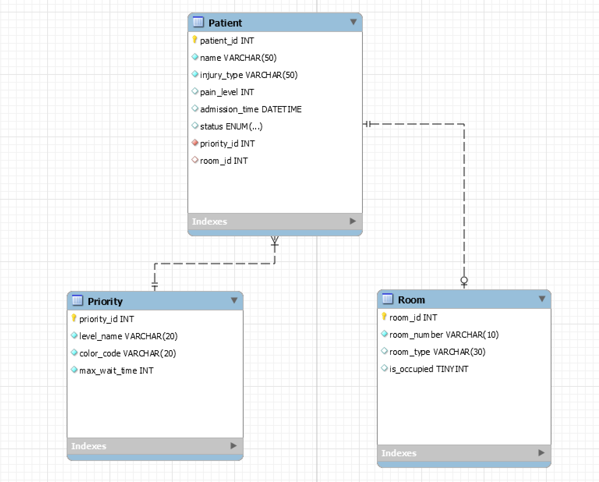

# Database Design Documentation

This document outlines the database schema for the Hospital Triage System. The database is designed to manage patient intake, triage priority logic, and room assignment efficiency.

## 1. Entities Description

The system comprises three core entities:

1.  **Patients**:
    * **Description**: Represents the individuals checking into the ER.
    * **Data Stored**: Stores personal information, the self-reported injury data , pain levels, and current status (Waiting, In Treatment, Discharged).
2.  **Priorities**:
    * **Description**: A lookup entity defining the triage severity levels.
    * **Data Stored**: Priority names, visual color codes, and response time targets.
3.  **Rooms**:
    * **Description**: Represents physical locations within the Emergency Department where patients are treated.
    * **Data Stored**: Room numbers, department , and current availability status.

---

## 2. Attributes Specification

### Entity: Patients
| Attribute | Data Type | Constraints | Description |
| :--- | :--- | :--- | :--- |
| `patient_id` | INT | **PRIMARY KEY**, AUTO_INCREMENT | Unique identifier for the patient. |
| `full_name` | VARCHAR(100) | NOT NULL | Patient's legal name. |
| `injury_type` | VARCHAR(50) | NOT NULL | Selected category (e.g., "Heart", "Limbs"). |
| `pain_level` | INT | CHECK (1-10) | Self-reported pain scale value. |
| `admission_time` | DATETIME | DEFAULT CURRENT_TIMESTAMP | Time the entry was submitted. |
| `status` | ENUM | 'Waiting', 'Treating', 'Discharged' | Current workflow state. |
| `priority_id` | INT | **FOREIGN KEY** | References `Priorities(priority_id)`. |
| `assigned_room_id` | INT | **FOREIGN KEY**, NULLABLE | References `Rooms(room_id)`. |

### Entity: Priorities
| Attribute | Data Type | Constraints | Description |
|   
| `priority_id` | INT | **PRIMARY KEY** | Unique identifier for priority level. |
| `level_name` | VARCHAR(20) | NOT NULL, UNIQUE | E.g., "Critical", "Urgent", "Stable". |
| `color_code` | VARCHAR(7) | NOT NULL | Hex code (e.g., #E53935) for UI rendering. |
| `max_wait_time` | INT | NOT NULL | Target wait time in minutes. |

### Entity: Rooms
| Attribute | Data Type | Constraints | Description |
|
| `room_id` | INT | **PRIMARY KEY** | Unique identifier for the room. |
| `room_number` | VARCHAR(10) | NOT NULL, UNIQUE | Physical room label (e.g., "ER-101"). |
| `department` | VARCHAR(50) | DEFAULT 'General' | Type of room (e.g., Trauma, General). |
| `is_occupied` | BOOLEAN | DEFAULT FALSE | Quick flag for availability. |

---

## 3. Relationships

* **Priorities to Patients (1:N)Non-identifying**: One Priority level can be assigned to many Patients but one Patient has only one Priority level.
* **Rooms to Patients (1:1)Non-identifying**: A Room can accommodate only one Patient at a time. A Patient is assigned only to one Room.